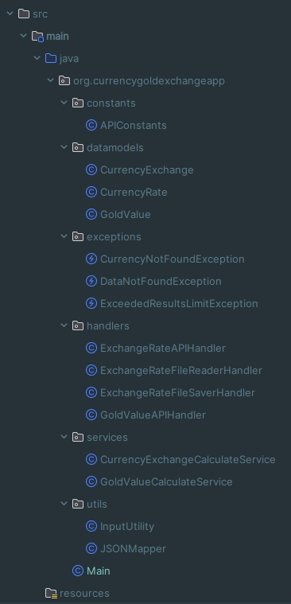
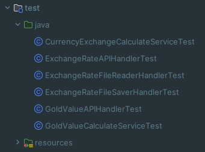

# CurrencyGoldExchangeApp

## Table of Contents
1. Project Description
2. Application Features
3. How to Run the Application
4. Testing

## Project Description
CurrencyGoldExchangeApp is a Java application for managing information related to currency exchange rates and gold prices. The project includes various features, such as retrieving current currency exchange rates, calculating currency values, analyzing gold prices, and saving transaction information.

## Application Features
### 1. Saving Exchange Rate Information
The application allows saving information about exchange rates from a selected day into a dedicated Java object containing a list of exchange rates with a given date.

### 2. Retrieving Exchange Rates from NBP API
Using the built-in toolset for generating GET requests, users can retrieve exchange rates from the NBP API for a specific day. The application also supports the option to automatically fetch data for the current day if no date is provided.

### 3. Currency Exchange Calculator
Users can input currency, amount, an optional date parameter, and the currency to exchange to. The application returns the value of the exchanged currency, taking into account the relevant exchange rate for the given day. If a currency other than PLN is used, calculations are performed according to the current rates.

### 4. CSV File Currency Value Calculator
The project allows reading the contents of a CSV file and returns the amount that currency 1 is worth in currency 2. If currency 2 is different than PLN, calculations are made accordingly, using the ask price for calculations.

### 5. Saving Transaction Information
Transactional information is saved to a file using the existing mechanism in the application.

### 6. Retrieving Gold Price Information from NBP API
A tool for retrieving information about the gold price for a specific day from the NBP API. Data is saved in a dedicated data model containing the value in PLN and the date.

### 7. Gold Calculator - Historical Data Analysis
The calculator analyzes historical data on gold prices, calculates the best price for the month/year starting from the current day, compares it with the current price, and provides information on the gains/losses associated with selling gold today compared to the best price.

## How to Run the Application
To run the application, follow these steps:
1. Download the repository to your local computer.
2. Open the project in IntelliJ IDEA or another Java-compatible environment.
3. Run the CurrencyGoldExchangeApp class or use built-in tools for compilation and execution.

## Testing
The project includes a set of unit tests that can be run to verify the correctness of various functions. To run the tests, use the tools available in the development environment.

## Project structure main

## Project structure test
